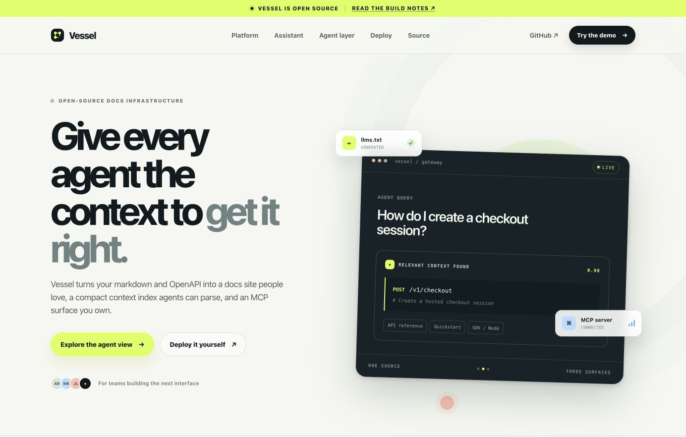
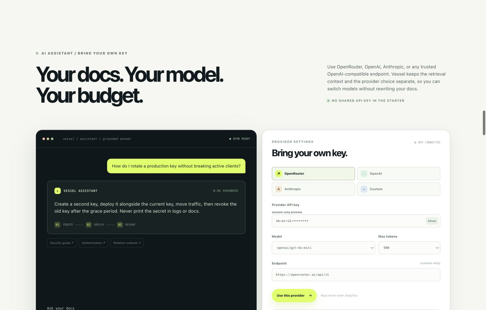
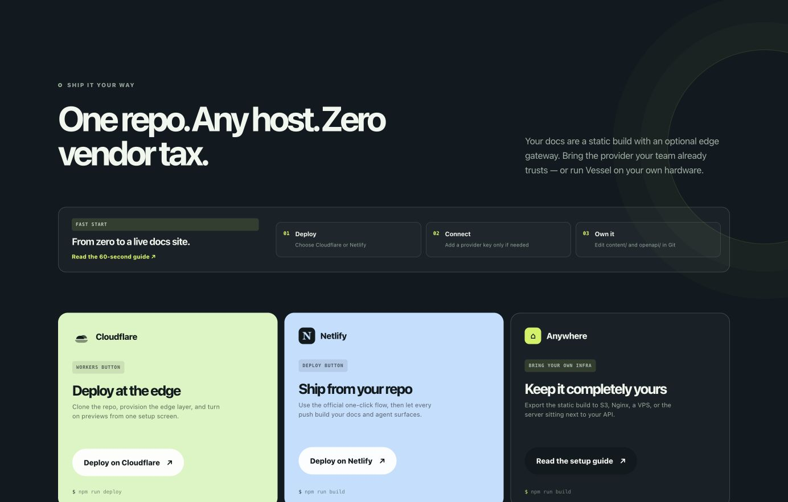
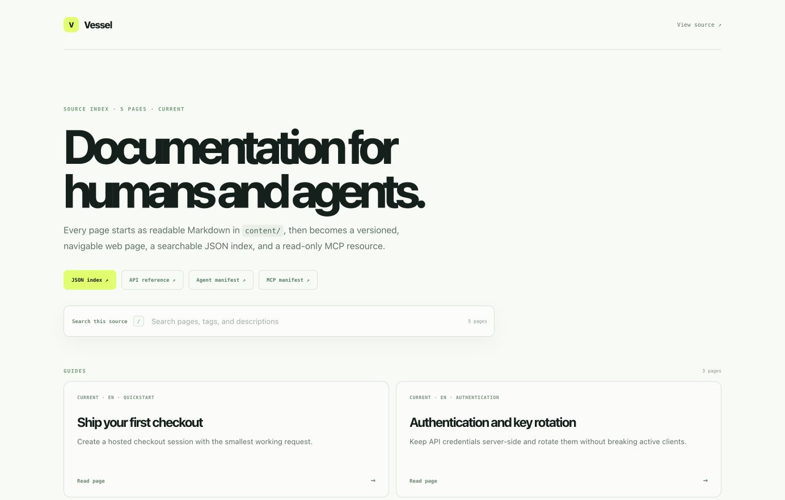
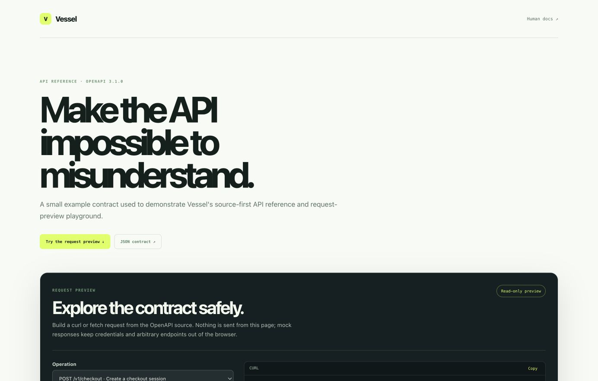

# Vessel visual tour

These screenshots are captured from the current production build with `npm run preview` at a 1384 × 882 desktop viewport. They show the real static-first UI shipped in this repository; no hosted service or API key is required to view them.

## Landing page

The open-source product story starts with one Git-backed source becoming human docs, agent context, and an MCP-ready surface.

## BYOK Assistant

The Assistant keeps provider choice and credentials in the user's control. OpenRouter, OpenAI, Anthropic, and custom OpenAI-compatible endpoints are supported.

## One-click self-hosting

The deploy surface makes Cloudflare Workers, Netlify, and bring-your-own infrastructure first-class paths.

## Human and agent documentation

The generated docs surface includes navigation, search, source metadata, and links to machine-readable contracts.

## API reference and safe request preview

The OpenAPI surface explains the contract and builds curl or fetch examples without sending requests from the public page.

To refresh the gallery after a UI change, run the local preview server, capture the same routes, and keep the images aligned with the current build:

- `/` — landing page
- `/#assistant-studio` — BYOK Assistant
- `/#deploy` — self-hosting options
- `/docs/` — human and agent docs
- `/api/` — API reference and request preview
